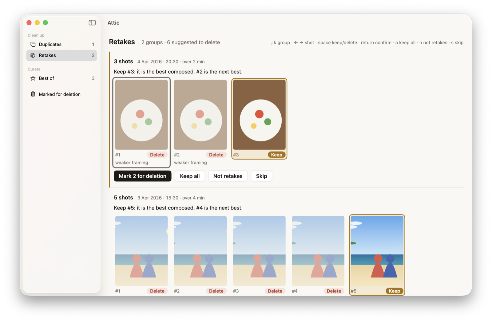
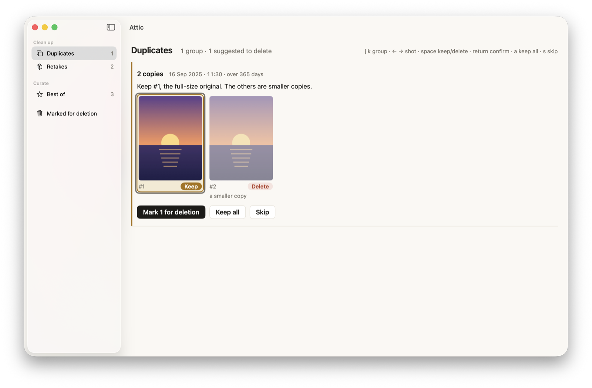
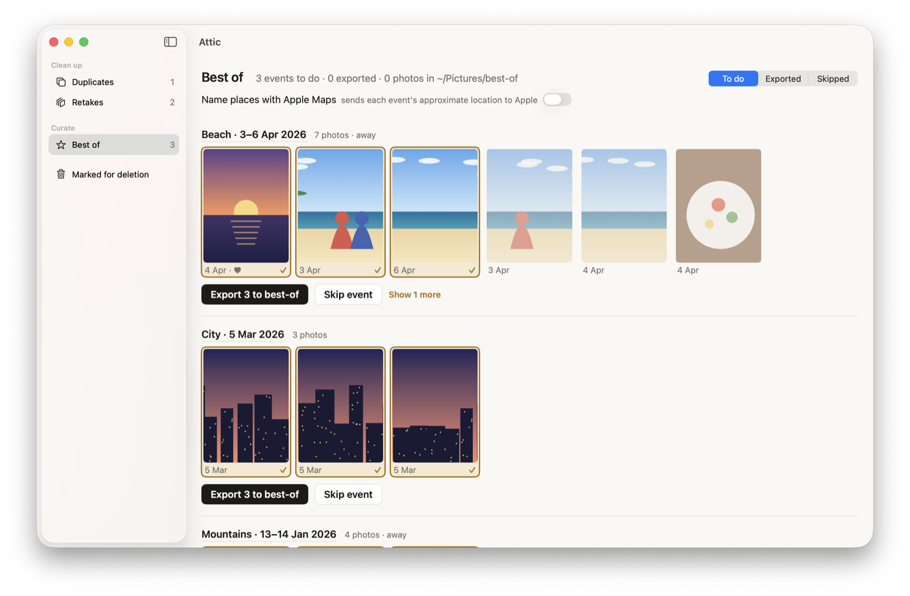
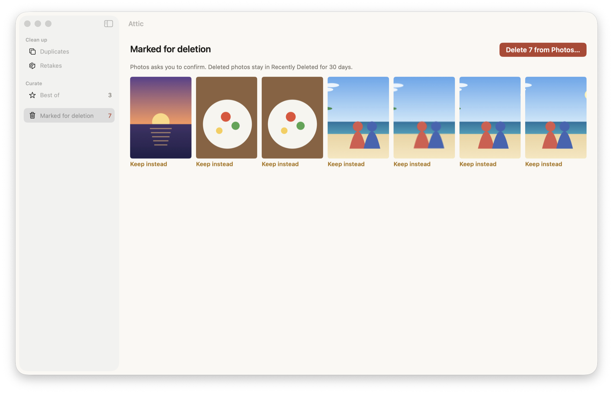

# Attic

A Mac app for your Apple Photos library: find duplicates, clean up retakes,
and pick the best photos from every trip and event. Everything runs on your
Mac. Your photos are never uploaded anywhere.

**[Download Attic for Mac](../../releases/latest/download/Attic.dmg)**
· macOS 15+ · Apple Silicon · free and open source


## Why you'd use it

- **You took eleven shots to get one where everyone's eyes are open.** Attic
  groups those tries together, suggests the keeper ("the faces are clearest";
  "#2 blinked"), and marks the rest to delete in one go.
- **The same photo is in your library three times.** It came back from a
  WhatsApp group, a friend's AirDrop and a second import. Attic finds copies
  even years apart and keeps the full-size original.
- **iCloud says your storage is full.** Clearing retakes and copies is the
  fastest way to win space back without touching the photos that matter.
- **You want the best 20 photos from a trip,** for a photo book, a slideshow or
  the family group. Attic splits your library into events (a beach week, a
  mountain weekend, a city evening), suggests three picks for each, and exports
  the ones you tick to one folder.
- **You want to give an app or an AI assistant some of your photos, not all of
  them.** Export a curated folder and share only that. The rest of your library
  stays put.

## How it looks

These screenshots use an illustrated demo library, drawn in code with no real
photos. Run `Attic --make-demo <dir>` to generate it.

**Retakes:** several tries at one moment, with the keeper suggested and the
reason given.


**Duplicates:** the same picture more than once. The small re-saved copy goes,
and the original stays.


**Best of:** events by time, place and activity, three picks each. Nothing is
exported until you press Export.


**One careful delete:** everything you marked, in one place. Photos asks you
to confirm, and deleted photos stay in Recently Deleted for 30 days.


## Privacy

- Photos are analysed on your Mac with Apple's Vision framework.
- Nothing is uploaded, and photos that are only in iCloud aren't downloaded
  for analysis. Originals are fetched only for photos you export.
- One setting is off by default: "Name places with Apple Maps" sends each
  event's approximate location to Apple to name it.
- Your decisions are remembered locally, so a rescan only asks about new
  photos.

## Install

1. [Download Attic.dmg](../../releases/latest/download/Attic.dmg),
   open it, and drag Attic to **Applications**. If you aren't an admin on this
   Mac, use **~/Applications** instead (create the folder if it doesn't exist).
2. The first time you open it, macOS says it can't verify the app. Attic isn't
   notarized by Apple yet. Open **System Settings › Privacy & Security**,
   scroll down, and click **Open Anyway** next to Attic.
3. Allow access to your photo library when asked.

To update, quit Attic and drag the new version over the old one. Your
decisions stay; they live in `~/Library/Application Support/Attic`.
Tip: `gh release download -R <owner>/attic -p Attic.dmg` downloads without the
quarantine flag, so there's no "Open Anyway" step.

## Build from source

Needs the Xcode Command Line Tools (`xcode-select --install`). Xcode itself
isn't needed.

```sh
./check.sh               # tests and checks
./deploy.sh              # build and install to ~/Applications
scripts/screenshots.sh   # regenerate the README screenshots from the demo library
```

Maintainers release with `git tag -a vX.Y.Z -m "<what changed>" && ./release.sh --publish`.
See [AGENTS.md](AGENTS.md) for how it works.

## License

MIT. See [LICENSE](LICENSE).
